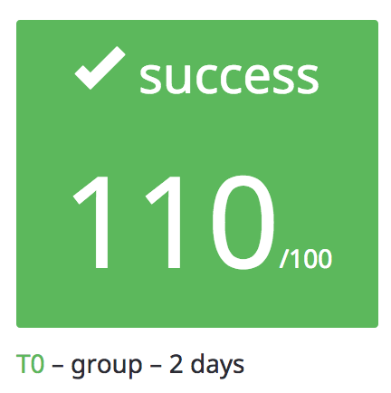

# École 42

## Rushes

The rushes are the ideal way to explore problems that are complementary
to the regular projects of the curriculum, in immersion with your colleagues.
For example, on a weekend, there's going to be a specific topic a to
concentrate, cross new heads for the future projects, and adopt an intensive
rhythm!

### List

> [LibUnit](libunit)

> [Hotrace](hotrace)

> [ft_contrast](ft_contrast)

* Grade pending...
